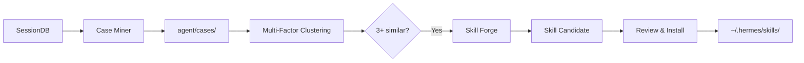

# Hermes Skill Evolution

> Automatically discover reusable workflow patterns from Hermes Agent session history and precipitate them into Skills.

**Zero modifications to Hermes core.** This is a self-contained add-on that reads SessionDB read-only and writes to its own directories.

## How It Works

```
945 sessions → 155 cases → 14 skill candidates (real data run)
```

Three components work together:

| Component | What it does | When |
|-----------|-------------|------|
| **Hook** (`hook.py`) | Incrementally scans new sessions, extracts cases, checks threshold | Cron every 2h |
| **CLI** (`skill_evolution.py`) | Scan, cluster, forge, report, install | Manual |
| **Case DB** (`agent/cases/`) | Accumulated case files with tool signatures, user intent, n-gram patterns | Persistent |

### Pipeline



### Clustering Algorithm

Four weighted dimensions determine case similarity:

| Dimension | Weight | What it captures |
|-----------|--------|-----------------|
| Tool signature | 0.30 | 8 categories: SHELL, BROWSER, CODE, WEB, FILE, CRON, EMAIL, NOTIFY |
| User intent | 0.30 | install-setup, research, fix-debug, search-find, download-media, etc. |
| N-gram sequence | 0.20 | Bigram/trigram of tool categories (e.g. `SHELL>SHELL>FILE`) |
| Keyword similarity | 0.20 | Chinese word tokenization + Jaccard similarity |

This correctly distinguishes "terminal-heavy" sessions into sub-categories like "model installs" vs "RSS fixes" vs "hotel queries" — something simple keyword matching cannot do.

## Quick Start

```bash
# 1. Clone to scripts directory
cp -r scripts ~/.hermes/

# 2. Register the cron hook
hermes cron create \
  --name skill-evolution \
  --schedule "every 2h" \
  --script skill_evolution_hook.py \
  --no-agent

# 3. Or run manually
cd ~/.hermes/scripts
python3 skill_evolution.py scan --limit 500
python3 skill_evolution.py forge --min-cases 3
python3 skill_evolution.py report
```

## CLI Reference

```bash
python3 skill_evolution.py scan --limit 100    # Scan recent sessions
python3 skill_evolution.py scan --all          # Scan ALL sessions
python3 skill_evolution.py cluster             # Cluster existing cases
python3 skill_evolution.py forge --min-cases 3 # Generate skill drafts
python3 skill_evolution.py report              # Show candidates
python3 skill_evolution.py validate            # Validate test scenarios
python3 skill_evolution.py install <name>      # Install as Hermes skill
python3 skill_evolution.py test                # Run 15 unit tests
python3 skill_evolution.py status              # System status
```

## Architecture

```
~/.hermes/scripts/
├── skill_evolution.py              # CLI orchestrator
├── skill_evolution_hook.py         # Cron entry wrapper
└── evolution/
    ├── __init__.py                    # v0.1.0
    ├── ARCHITECTURE.md                # Full design doc
    ├── signatures.py                  # Tool call signature system
    ├── miner.py                       # Case extraction + clustering (~280 lines)
    ├── forge.py                       # Skill draft generation (~166 lines)
    ├── hook.py                        # Incremental cron hook (~127 lines)
    └── validator.py                   # Candidate validation (~47 lines)

~/.hermes/agent/
├── cases/                             # Case database
├── candidates/                        # Skill drafts
├── .case_index.json                   # Incremental state
└── clusters.json                      # Cluster results
```

## Design Principles

1. **No core modifications** — zero changes to `hermes_state.py`, `run_agent.py`, `model_tools.py`
2. **Incremental** — cron hook processes only new sessions, tracks state via `.case_index.json`
3. **Zero token cost** — hook runs in `no_agent` mode
4. **Safe by design** — requires 3+ similar cases before suggesting, never auto-creates skills
5. **LLM-ready** — forge supports LLM-driven analysis (disabled when API key unavailable)

## Test Results

```
$ python3 skill_evolution.py test

✅ 15/15 tests passed
  - SHELL-heavy classification
  - BROWSER-heavy classification
  - HYBRID detection
  - Cosine similarity (same type > 0.9, different < 0.5)
  - N-gram extraction (bigram + trigram)
  - Chinese intent extraction (install, research, download)
  - Full pipeline integration (mock session)
```

## Real-World Data

Tested against 900+ Hermes Agent sessions across months of usage:

| Cluster Type | Example Tasks |
|-------------|---------------|
| Command-line workflows | Model installs, configuration setup |
| File operations | Git history search, version recovery |
| Web research | Tech research, competitor analysis |
| Debug/Fix patterns | RSS fixes, config troubleshooting |
| Monitoring | Status checks, availability queries |

The clustering algorithm correctly distinguishes "terminal-heavy" sessions into sub-categories like "install/setup" vs "debug/fix" vs "information query" — something simple keyword matching cannot do.

## Performance

- Full scan of 945 sessions: **~2 seconds**
- Incremental run (no new sessions): **~0.3 seconds**
- Cron hook: **zero token consumption** (no_agent mode)

## License

MIT
